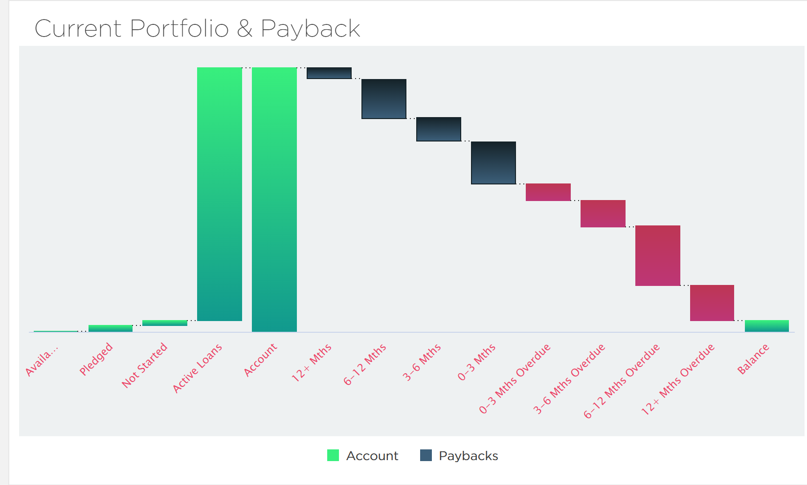
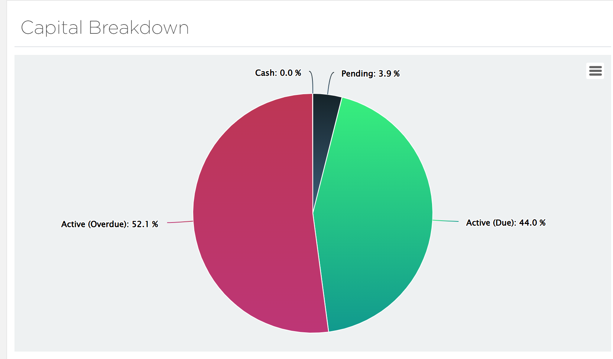
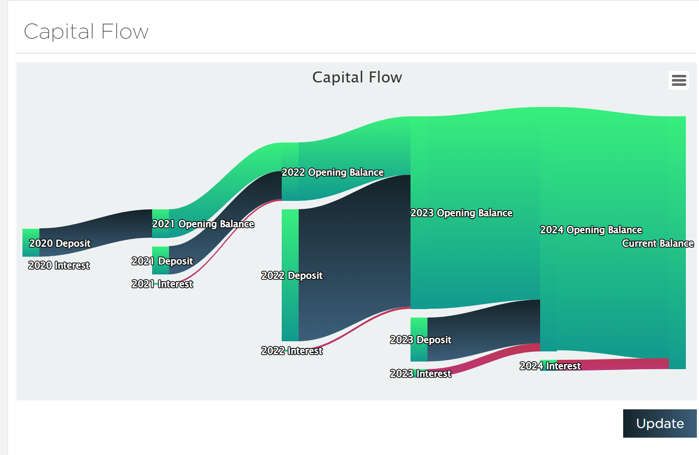

# Chrome Extension for Crowd Property

A 3rd party extension to add some extra features to the Crowd Property website.

## Installation

1. Download the repo to your computer.
   1. Either, clone using `git`:
   ```
    git clone https://github.com/IJMacD/crowdproperty-extension.git
   ```

   2. Or, download latest zip (https://github.com/IJMacD/crowdproperty-extension/archive/refs/heads/master.zip)
   and extract.
2. Go to [chrome://extensions/](chrome://extensions/)
3. Click **Load Unpacked**
4. Select the directory you extracted the extension into.


## Additional Charts

Some charts have been added and others improved.

### Waterfall Chart



Highlights difference between pledges which are still due vs those which are
overdue. Also re-aligns *Available*, *Pledged*, and *Not Started* (on the left)
with *Balance* (on the right) as these amounts correspond to each other.

Conceptually the capital moves from left to right. It starts by heading away
from the user (towards the top of the chart) then slowly returns back down the
waterfall towards the user, eventually dropping back into the *Balance* bucket
at the end.


### Pie Chart



Shows a breakdown of where your capital currently is.

### Sankey Chart



Visual representation of the flow of capital across the years the account has
been open.
